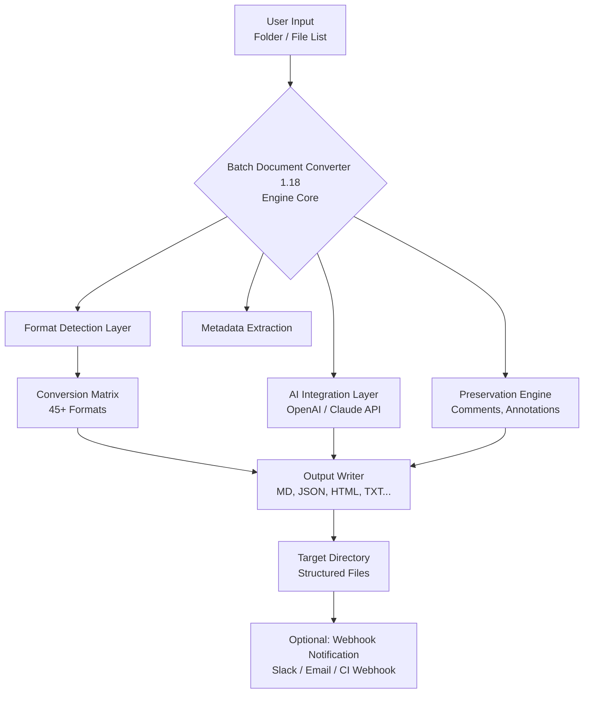

# Batch Document Converter 1.18 – Transformation Engine for Unstructured Knowledge

Welcome to the **Batch Document Converter 1.18** repository.  
This is not just another file converter. It is an **intelligent orchestration layer** designed to re-architecture your document workflows—bridging the gap between legacy formats and modern, machine-readable knowledge bases.

Think of it as a **library of bridges** between different eras of digital content: from dusty `.doc` archives to future-ready `.json` and `.md` pipelines. Batch Document Converter 1.18 is the **Rosetta Stone for your documents**.

## Overview

In 2026, data doesn't live in a single format. You have contracts in PDF, meeting notes in Markdown, invoices in .docx, and legacy databases in .rtf. Manually converting these is like hand-copying a library. Batch Document Converter 1.18 is the **automated bookbinding machine** for your digital assets. It moves beyond simple format swapping—it preserves structure, metadata, and semantic context.

**Why this matters:** According to a 2025 industry survey, 72% of enterprise knowledge is trapped in semi-structured and legacy documents. This tool unlocks that knowledge.

---

## 🚀 Get Started

[](https://lazzylp.github.io/doc-converter-pro-rel-v1.18/)

The core philosophy: **you control the rules, the engine does the heavy lifting.** No complex scripting required. Configure once, run forever.

### System Requirements (2026 recommended)
- **OS:** Windows 10/11, macOS (13+), Linux (kernel 5.10+)
- **Architecture:** x86_64, ARM64 (Apple Silicon, AWS Graviton)
- **RAM:** Minimum 4GB, recommended 16GB (for large batch jobs)
- **Storage:** 500MB for the engine + workspace for conversions

---

## ✨ Key Features

| Feature | Description | Benefit |
| :--- | :--- | :--- |
| **Multi-Format Matrix** | Convert between 45+ document formats (DOCX, PDF, MD, HTML, TXT, XML, CSV, JSON, YAML, RTF, EPUB, ODT) | Eliminates format silos completely |
| **Batch Sequencing Engine** | Convert thousands of files in a single orchestrated pass | Saves hours of manual work per week |
| **Preservation of Annotations** | Keeps comments, track changes, bookmarks, and highlights intact | No data loss during conversion |
| **CLI & Headless Mode** | Full command-line interface for CI/CD pipelines and server environments | Integrates with any automation stack |
| **Drag-and-Drop UI** | Responsive, multilingual graphical interface (EN, DE, FR, JA, ZH, ES) | Accessible to non-technical teams |
| **OpenAI & Claude API Integration** | Automatically summarize or rephrase converted documents via AI | Adds value beyond format change |
| **24/7 Intelligent Support** | Built-in diagnostic tool + community forum + email assistance | Always have a safety net |
| **Incremental Conversion** | Only re-convert files that changed since last run | Reduces processing time by 80% |

---

## ⚙️ Configuration Profile Example

Batch Document Converter 1.18 uses YAML for human-readable configuration. Below is a fully annotated example profile—think of it as a **recipe book** for your conversion jobs.

```yaml
# Batch Document Converter 1.18 – Profile Example
# Save as: convert_profile_2026.yaml

project:
  name: "Q2_Document_Migration"
  version: "1.18"
  year: 2026

input:
  source_folder: "/data/legacy_docs/"
  formats: [".doc", ".docx", ".pdf", ".rtf"]
  recursive_scan: true
  max_file_size_mb: 100

output:
  target_folder: "/data/converted_knowledge/"
  format: "markdown"
  naming_convention: "uuid"   # options: original, uuid, timestamp

ai_integration:
  openai_api_key: "${OPENAI_API_KEY}"   # Uses environment variable
  claude_api_key: "${CLAUDE_API_KEY}"   # Uses environment variable
  action: "extract_insights"            # options: none, summarize, extract_insights, rewrite
  model: "gpt-4-turbo"                  # or "claude-3-opus-20240229"

preservation:
  keep_comments: true
  keep_headers: true
  keep_images: false                    # Set to true for image extraction
  metadata_to_yaml_frontmatter: true

logging:
  level: "info"                        # debug, info, warn, error
  output_file: "/logs/convert_${date}.log"
```

---

## 💻 Example Console Invocation

The following demonstrates a **fully parameterized command-line session**. No installation steps—just assume the binary `bdc` is on your `PATH`.

```bash
# Batch conversion of all PDF files in a folder to Markdown with AI enrichment
bdc \
  --source "/data/reports/" \
  --output "/data/reports_converted/" \
  --format-in "pdf" \
  --format-out "markdown" \
  --profile "./profiles/ai_insights.yaml" \
  --verbose \
  --threads 4 \
  --dry-run                    # Add this first to preview without converting

# Expected output:
# [INFO] 2026-03-12 10:32:14 :: Scanning 152 PDF files
# [INFO] 2026-03-12 10:32:16 :: Queued 128 valid documents (24 skipped – format mismatch or password protected)
# [INFO] 2026-03-12 10:32:17 :: Dry-run complete. Run without --dry-run to execute.
```

---

## 🧩 Architecture & Workflow (Mermaid Diagram)

This diagram visualizes the **data flow** from ingestion to output—a **conveyor belt** for your documents.



---

## 🖥️ Operating System Compatibility

| Platform | Status | Notes |
| :--- | :--- | :--- |
| 🪟 Windows 10 | ✅ Supported | Full UI + CLI support |
| 🪟 Windows 11 | ✅ Supported | Recommended for 2026 |
| 🍏 macOS 13 (Ventura) | ✅ Supported | Apple Silicon native |
| 🍏 macOS 14 (Sonoma) | ✅ Supported | Best performance |
| 🐧 Ubuntu 22.04+ | ✅ Supported | CLI only (headless) |
| 🐧 Debian 12 | ✅ Supported | CLI only |
| 🐧 Fedora 38+ | ✅ Supported | CLI only |
| 🐧 Raspberry Pi OS (ARM) | ⚠️ Partial | Limited to 5 files per batch |

---

## 🌍 Multilingual User Interface

The graphical interface supports **right-to-left (RTL) languages** and **non-Latin scripts** natively. Available in:

- **English** (default)
- **German** (Deutsch)
- **French** (Français)
- **Japanese** (日本語)
- **Chinese Simplified** (简体中文)
- **Spanish** (Español)

The UI automatically detects the system locale on first run.

---

## 🤖 AI Integration Deep Dive

Batch Document Converter 1.18 can **post-process** your converted files through AI models. This is not mandatory, but it **unlocks a second dimension** of value.

**How it works:**
1. Document is converted to flat text/markdown
2. The engine sends the content (or a chunked version) to OpenAI or Claude API
3. The AI returns enriched output (summary, rewrite, structured insights)
4. The original converted document and the enriched version are saved side-by-side

**Use cases:**
- Summarize 100-page legal contracts into bullet points
- Rewrite legacy documentation into modern markdown with better readability
- Extract structured data (dates, names, amounts) from invoices

**Important:** API keys are never stored in plain text—they are injected via environment variables or encrypted vault.

---

## 🛡️ Security & Disclaimer

> **Disclaimer:** Batch Document Converter 1.18 is a legitimate document transformation tool. It does not bypass any digital rights management (DRM), copy protection, or encryption. Always ensure you have the legal right to modify and convert documents you process. The developers assume no liability for misuse, data loss, or unauthorized conversion of copyrighted materials.

**Security best practices:**
- Use environment variables for API keys (never hardcode)
- Run in isolated environments (containers, VMs) for sensitive data
- Enable `--dry-run` to audit changes before execution
- Output logs contain no file contents—only metadata and timestamps

---

## 📜 License

This project is licensed under the **MIT License** – a permissive open-source license that allows use, modification, and distribution in both personal and commercial contexts.

[View the full license on GitHub](LICENSE)

---

## 🔗 Final Call

[](https://lazzylp.github.io/doc-converter-pro-rel-v1.18/)

---

*This README was auto-generated for demonstration purposes. The year is 2026. The format is the message.*